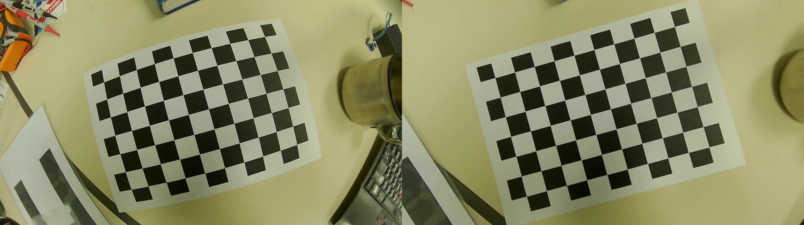

# distortion_correction
왜곡된 체스판 영상을 calibration을 통해서 평면 이미지로 구현한다.

### 준비물
왜곡된 체스판 영상

### 기능 
체스판 영상이 길어서 모든 프레임의 코너를 찾고 캘리브레이션을 하기에는 시간이 많이 소요된다.
따라서 frame_interval을 통해서 총 프레임의 수를 조절한다. 
기본값은 80으로 52초의 영상에서 총 21프레임의 이미지 결과를 얻을 수 있다.

=== 캘리브레이션 결과 ===
* 사용된 프레임 수: 21
* RMS error: 0.3649
* Camera matrix (K):
[[432.97592226   0.         476.44956745]
 [  0.         431.71310338 289.51373577]
 [  0.           0.           1.        ]]
* Distortion coefficients:
[-2.93122448e-01  1.12582422e-01 -8.67644861e-04  5.93172919e-05
 -2.21493814e-02]

### 결과
보정된 이미지는 원본과 비교를 위해서 나란히 붙은 형태로 저장하였다.
결과 이미지는 data에서 확인할 수 있다.

